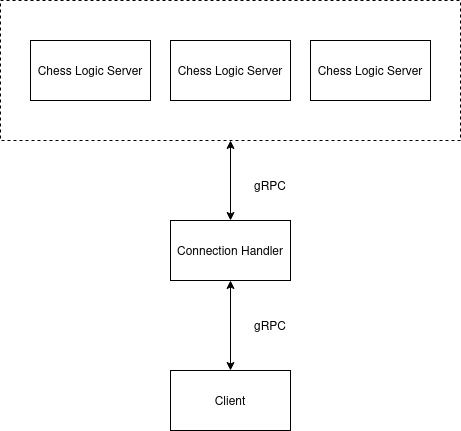

# XadrezDistribuido
A Distributed Systems Project that implements a system that handles multiples chess games simultaneously.

## Video

https://drive.google.com/file/d/1CRupDzh527E4116pvhVaM5NHkcCqmoyg/view?usp=drive_link

## Setup
Create a Docker network:
```
sudo docker network create --subnet=192.168.100.0/16 --gateway=192.168.100.1 chessnet
```
Execute the game logic server:
```
sudo docker build -t ruby-chess-server .
sudo docker run -it --rm --net chessnet --ip [IP] --name ruby-chess-server ruby-chess-server
```
Execute the handler:
```
sudo docker build -t python-handler .
sudo docker run -it --rm --net chessnet --ip 192.168.100.3 --name python-handler python-handler
```
Execute the client:
```
sudo docker build -t golang-client .
sudo docker run -it --rm --net chessnet --ip [IP] golang-client
```
## Concurrency
Multiple matches can occur at once because the handler will have multiple threads listening to the gRPC requests of each client and every match will be processed independently.

## Scalability
In the Handler you can increase the amount of threads in the ThreadPool, and declare more servers on the chess_servers list inside the gRPC server.

## Architecture
